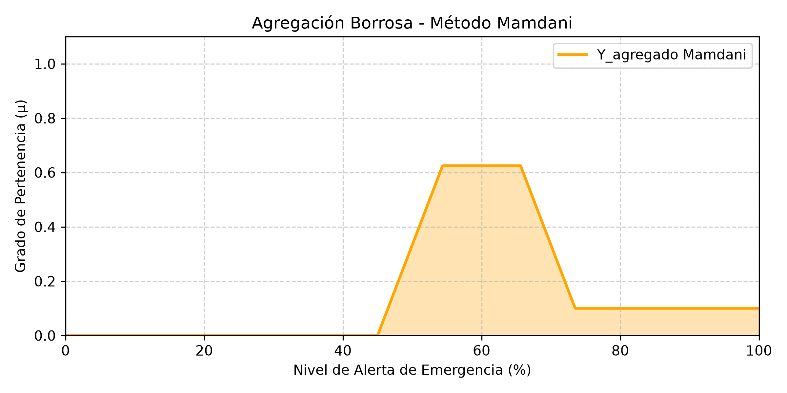
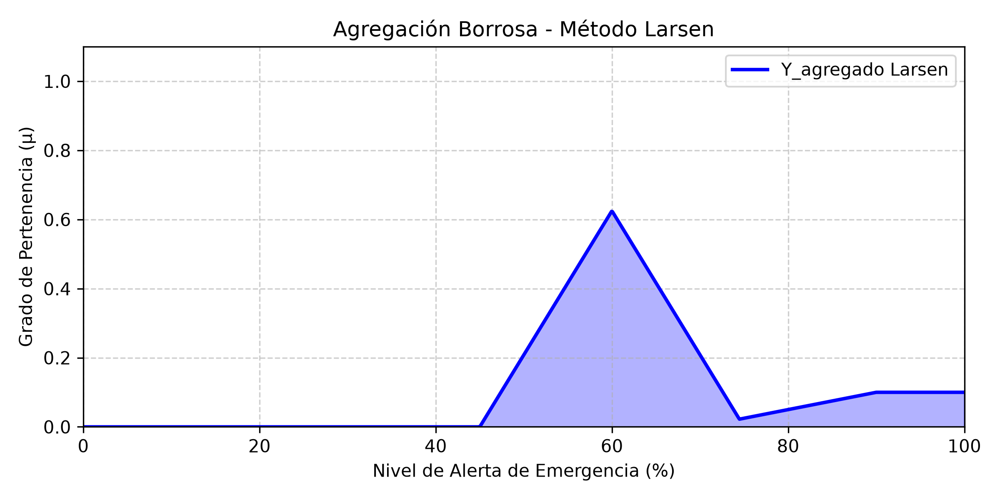

# MEMORIAS DE CÁLCULO - CASO 1: LÓGICA DIFUSA

**Escenario Evaluado:**

* **$X_1$ (Nivel del Río):** 7.3 metros
* **$X_2$ (Precipitación Acumulada):** 115 mm en 24 horas

---

## 1. FUSIFICACIÓN ANALÍTICA

### Evaluación para $X_1 = 7.3$ (Nivel del Río)

Se evalúa el valor nítido en las ecuaciones de los conjuntos difusos de entrada.

* **Bajo:**
    Ecuación teórica: $\mu_{Bajo}(x) = 0 \text{ si } x > 4$
    Sustitución: Como $7.3 > 4 \rightarrow \mu_{Bajo}(7.3) = 0$

* **Normal:**
    Ecuación teórica: $\mu_{Normal}(x) = 0 \text{ si } x \leq 3 \text{ o } x \geq 7$
    Sustitución: Como $7.3 \geq 7 \rightarrow \mu_{Normal}(7.3) = 0$

* **Alerta:**
    Ecuación teórica: $\mu_{Alerta}(x) = \frac{x - 6}{1.5} \text{ si } 6 < x \leq 7.5$
    Sustitución: Dado que $7.3 \in (6, 7.5]$, aplicamos la fórmula:
    $$ \mu_{Alerta}(7.3) = \frac{7.3 - 6}{1.5} = \frac{1.3}{1.5} \approx 0.8667 $$

* **Crítico:**
    Ecuación teórica: $\mu_{Critico}(x) = 0 \text{ si } x \leq 8$
    Sustitución: Como $7.3 \leq 8 \rightarrow \mu_{Critico}(7.3) = 0$

### Evaluación para $X_2 = 115$ (Precipitación Acumulada)

Se evalúa el valor nítido en las ecuaciones correspondientes.

* **Seco:**
    Ecuación teórica: $\mu_{Seco}(x) = 0 \text{ si } x > 80$
    Sustitución: Como $115 > 80 \rightarrow \mu_{Seco}(115) = 0$

* **Moderado:**
    Ecuación teórica: $\mu_{Moderado}(x) = \frac{140 - x}{40} \text{ si } 100 < x < 140$
    Sustitución: Dado que $115 \in (100, 140)$:
    $$ \mu_{Moderado}(115) = \frac{140 - 115}{40} = \frac{25}{40} = 0.625 $$

* **Lluvia Fuerte:**
    Ecuación teórica: $\mu_{Fuerte}(x) = \frac{x - 110}{50} \text{ si } 110 < x \leq 160$
    Sustitución: Dado que $115 \in (110, 160]$:
    $$ \mu_{Fuerte}(115) = \frac{115 - 110}{50} = \frac{5}{50} = 0.1 $$

---

## 2. ANÁLISIS DE INFERENCIA COMPARATIVA

Se evalúan las 9 reglas utilizando el operador Mínimo (MIN) para el "Y" lógico y el operador Máximo (MAX) para el "O" lógico.

### 2.1. Fuerza de Activación de las 9 Reglas

* **R1:** SI $X_1$ es Bajo ENTONCES $Y$ es Nula.
    $\mu_{R1} = \mu_{Bajo} = 0$
* **R2:** SI $X_1$ es Normal Y $X_2$ es Seco ENTONCES $Y$ es Nula.
    $\mu_{R2} = \min(0, 0) = 0$
* **R3:** SI $X_1$ es Normal Y $X_2$ es Moderado ENTONCES $Y$ es Preventiva.
    $\mu_{R3} = \min(0, 0.625) = 0$
* **R4:** SI $X_1$ es Normal Y $X_2$ es Lluvia Fuerte ENTONCES $Y$ es Alerta Amarilla.
    $\mu_{R4} = \min(0, 0.1) = 0$
* **R5:** SI $X_1$ es Alerta Y $X_2$ es Seco ENTONCES $Y$ es Preventiva.
    $\mu_{R5} = \min(0.8667, 0) = 0$
* **R6:** SI $X_1$ es Alerta Y $X_2$ es Moderado ENTONCES $Y$ es Alerta Amarilla.
    $\mu_{R6} = \min(0.8667, 0.625) = \mathbf{0.625}$
* **R7:** SI $X_1$ es Alerta Y $X_2$ es Lluvia Fuerte ENTONCES $Y$ es Alerta Roja.
    $\mu_{R7} = \min(0.8667, 0.1) = \mathbf{0.1}$
* **R8:** SI $X_1$ es Crítico O $X_2$ es Lluvia Fuerte ENTONCES $Y$ es Alerta Roja.
    $\mu_{R8} = \max(\mu_{Critico}, \mu_{Fuerte}) = \max(0, 0.1) = \mathbf{0.1}$
* **R9:** SI $X_1$ es Crítico ENTONCES $Y$ es Alerta Roja.
    $\mu_{R9} = \mu_{Critico} = 0$

> **Conclusión:** Se activan las reglas **R6** (fuerza 0.625, hacia Alerta Amarilla), **R7** (fuerza 0.1, hacia Alerta Roja) y **R8** (fuerza 0.1, hacia Alerta Roja).

### 2.2. Definición Analítica de los Conjuntos de Salida

Para aplicar los métodos, definimos las ecuaciones originales de los conjuntos de salida activados:

**Alerta Amarilla:**

* $0$ si $y \leq 45$ o $y \geq 75$
* $\frac{y - 45}{15}$ si $45 < y \leq 60$
* $\frac{75 - y}{15}$ si $60 < y < 75$

**Alerta Roja:**

* $0$ si $y \leq 70$
* $\frac{y - 70}{20}$ si $70 < y \leq 90$
* $1$ si $y > 90$

### 2.3. Aplicación de los Métodos por Regla

#### Regla 6 (Fuerza = 0.625, Salida = Alerta Amarilla)

**a) Método Mamdani (Recorte):** $\mu_{R6\_Mamdani}(y) = \min(0.625, \mu_{Amarilla}(y))$

* Buscamos los puntos donde la función interseca el valor de 0.625:
  * Subida: $\frac{y - 45}{15} = 0.625 \rightarrow y - 45 = 9.375 \rightarrow y = 54.375$
  * Bajada: $\frac{75 - y}{15} = 0.625 \rightarrow 75 - y = 9.375 \rightarrow y = 65.625$
* **Ecuación resultante:**
  * $\frac{y - 45}{15}$ para $45 < y \leq 54.375$
  * $0.625$ para $54.375 < y \leq 65.625$
  * $\frac{75 - y}{15}$ para $65.625 < y < 75$

**b) Método Larsen (Escalado):** $\mu_{R6\_Larsen}(y) = 0.625 \times \mu_{Amarilla}(y)$

* **Ecuación resultante:**
  * $0.625 \left( \frac{y - 45}{15} \right) = \frac{y - 45}{24}$ para $45 < y \leq 60$
  * $0.625 \left( \frac{75 - y}{15} \right) = \frac{75 - y}{24}$ para $60 < y < 75$

#### Reglas 7 y 8 (Fuerza = 0.1, Salida = Alerta Roja)

*Como ambas reglas tienen la misma fuerza y el mismo consecuente, el resultado analítico es idéntico para ambas.*

**a) Método Mamdani (Recorte):** $\mu_{R7,8\_Mamdani}(y) = \min(0.1, \mu_{Roja}(y))$

* Buscamos la intersección: $\frac{y - 70}{20} = 0.1 \rightarrow y - 70 = 2 \rightarrow y = 72$
* **Ecuación resultante:**
  * $\frac{y - 70}{20}$ para $70 < y \leq 72$
  * $0.1$ para $y > 72$

**b) Método Larsen (Escalado):** $\mu_{R7,8\_Larsen}(y) = 0.1 \times \mu_{Roja}(y)$

* **Ecuación resultante:**
  * $0.1 \left( \frac{y - 70}{20} \right) = \frac{y - 70}{200}$ para $70 < y \leq 90$
  * $0.1 (1) = 0.1$ para $y > 90$

## 3. AGREGACIÓN BORROSA

En este paso se unen (operador MÁXIMO) los conjuntos recortados/escalados para formar el conjunto borroso global de salida ($Y_{agregado}$).

### a) Método Mamdani (Unión de Recortes)

Se intercepta la bajada de la Alerta Amarilla con la meseta de la Alerta Roja.

* Igualando: $\frac{75 - y}{15} = 0.1 \rightarrow 75 - y = 1.5 \rightarrow y = 73.5$

**Función $Y_{agregado\_Mamdani}(y)$:**

1. $\frac{y - 45}{15}$ para $45 < y \leq 54.375$
2. $0.625$ para $54.375 < y \leq 65.625$
3. $\frac{75 - y}{15}$ para $65.625 < y \leq 73.5$
4. $0.1$ para $73.5 < y \leq 100$
5. $0$ en cualquier otro caso.

### b) Método Larsen (Unión de Escalados)

Se intercepta la bajada de la Alerta Amarilla escalada con la subida de la Alerta Roja escalada.

* Igualando: $\frac{75 - y}{24} = \frac{y - 70}{200}$
* Resolviendo: $200(75 - y) = 24(y - 70) \rightarrow 15000 - 200y = 24y - 1680 \rightarrow 16680 = 224y \rightarrow y \approx 74.464$

**Función $Y_{agregado\_Larsen}(y)$:**

1. $\frac{y - 45}{24}$ para $45 < y \leq 60$
2. $\frac{75 - y}{24}$ para $60 < y \leq 74.464$
3. $\frac{y - 70}{200}$ para $74.464 < y \leq 90$
4. $0.1$ para $90 < y \leq 100$
5. $0$ en cualquier otro caso.

## 4. DESFUSIFICACIÓN DETALLADA

El objetivo es encontrar el valor nítido (un único porcentaje de 0 a 100) de la Alerta de Emergencia, utilizando dos métodos de desfusificación distintos sobre los dos métodos de inferencia.

### 4.1. Método del Centro de Máximos (CoM)

El Centro de Máximos promedia los valores de $y$ donde la función alcanza su punto más alto (el grado de pertenencia máximo).

* **Mamdani + CoM:**
    El valor máximo de la gráfica Mamdani es $\mu = 0.625$. Este valor se alcanza en una "meseta" plana desde $y = 54.375$ hasta $y = 65.625$.
    El centro de esta meseta es:
    $$ CoM_{Mamdani} = \frac{54.375 + 65.625}{2} = \frac{120}{2} = \mathbf{60.0\%} $$

* **Larsen + CoM:**
    El valor máximo de la gráfica Larsen también es $\mu = 0.625$, pero al ser un triángulo escalado, se alcanza en un único pico, exactamente en $y = 60$.
    $$ CoM_{Larsen} = \mathbf{60.0\%} $$

### 4.2. Método del Centro de Áreas (Centroide)

Se calculó aplicando la sumatoria discreta (discretización de 0.5% en 0.5%) solicitada por la metodología, usando la fórmula de momentos:
$$ Centroide = \frac{\sum_{y=0}^{100} y \cdot \mu(y)}{\sum_{y=0}^{100} \mu(y)} $$

* **Mamdani + Centroide:**
    Calculando la sumatoria discreta de momentos (Numerador) y de áreas (Denominador):
    $$ Centroide_{Mamdani} = \frac{2000.18}{30.98} \approx \mathbf{64.57\%} $$

* **Larsen + Centroide:**
    Calculando la sumatoria discreta de momentos y áreas:
    $$ Centroide_{Larsen} = \frac{1478.57}{22.69} \approx \mathbf{65.17\%} $$

---

## 5. CONCLUSIÓN Y TOMA DE DECISIONES

Tenemos las siguientes 4 combinaciones posibles de resultados para la Alerta de Emergencia ante la tormenta severa (X1=7.3m, X2=115mm):

1. **Mamdani + CoM:** 60.00%
2. **Larsen + CoM:** 60.00%
3. **Mamdani + Centroide:** 64.57%
4. **Larsen + Centroide:** 65.17%

**Justificación Metodológica:**
El método del **Centro de Máximos (CoM)** resulta ser de $60\%$ en ambos casos porque se enfoca *únicamente* en la regla dominante (Alerta Amarilla) e ignora por completo la cola de la gráfica (Alerta Roja con fuerza 0.1). Es un método rígido que descarta información minoritaria.

El método del **Centroide** considera el área total. Aunque la regla de Alerta Roja disparó con muy poca fuerza (0.1), el área que ocupa desde el 70% hasta el 100% genera un peso que arrastra el valor final hacia la derecha, subiendo la alerta a casi $65\%$.

**Recomendación Oficial para el Sistema de Alerta Temprana:**
En un contexto crítico de Protección Civil, ignorar las reglas extremas es sumamente peligroso. El sistema recomienda a las autoridades locales emitir una **Alerta Nivel 65.17%**, correspondiente a la agregación de factores climáticos bajo el modelo metodológicamente más seguro y conservador (Larsen + Centroide), garantizando que se consideren todas las variables de riesgo posibles.
